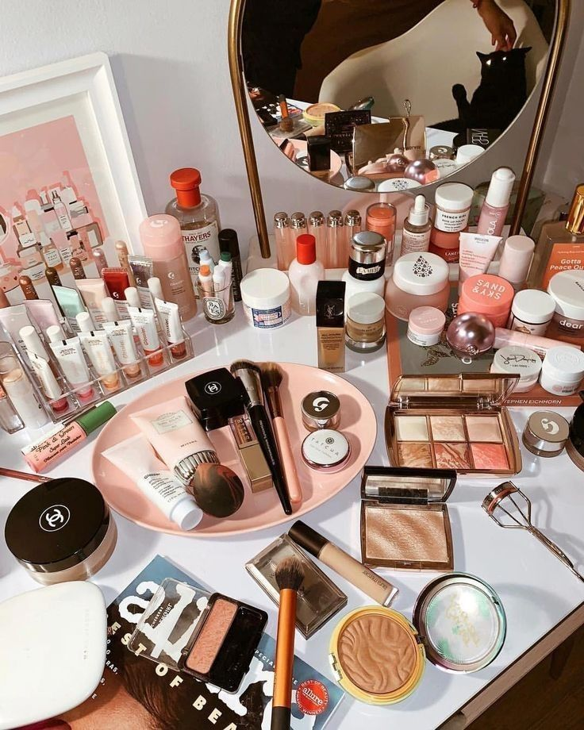

# ССЫЛКА НА СОДЕРЖИМОЕ file:///C:/Users/%D0%9C%D0%B0%D1%88%D0%B0/Desktop/dz3/index.html
<!DOCTYPE html>
<html>
 <head>
 <meta charset="UTF-8">
 <title> makeup-sunshine </title>
 <link rel="icon" href="original.jpg" type="image/x-icon" />
 
<body>

 <h1 align="center"> Здравствуйте! Я приветствую <em> Вас </em> на своей персональной странице.</h1>
 
 Контент, который будет здесь публиковаться мною, я хочу посвятить разбору макияжа и одежды. <em> Макияж - это о великом. Макияж - это не о том, чтобы стать красивее или уверенее. Макияж - это не о том, чтобы скрыть свои недостатки или подчеркнуть достинства. Макияж - это о Вас самих: ваша любимая музыка, мимолётное воспоминание, первый поцелуй, хобби. Макияж - это целая вселенная, которая есть внутри каждого из Вас. </em> 

 <h2 align="center">  Визуальный контент </h2>
 
 Чтобы наглядно продемонстрировать, как макияж может повлиять на наше восприятие себя и своего внутреннего мира, я буду публиковать различный фото-материал, а именно примеры идей для макияжа, пошаговые инструкции его нанесения, определённые лайфхаки, техники макияжа, такие как <strong> контуринг, стробинг, хроминг, аэромакияж </strong>. Также на сайте будут переодически выкладываться ссылки на видео известных бьюти-блоггеров. Например: <strong> Лиза Элдридж, Дарья Холодных, Никки, Дарья Каплан и тд. </strong> 

 <h3 align="center"> Макияж – привычное для большинства поколений людей явление. Но какова его история, в каких культурах, в какую эпоху он появился и для чего? </h3>
 
 Пожалуй, считать родиной косметики (от греч. kosmetike, что значит «искусство украшения») можно Древний Восток. Красились как мужчины, так и женщины, причем представления о том, как украшать лицо и тело у разных народов было специфическим. Весьма активно заботились о внешности египтянки: уголь – вместо карандаша для бровей, кровь черных быков – в качестве темной краски для волос (этим не брезговала и сама Клеопатра, дабы скрыть седину), лак для ногтей, помада, средства для отбеливания зубов из минералов с растениями, толчеными костями и зубами животных и т. п. Макияж использовали и в медицинских целях: египтяне считали, что, подводя глаза, они предотвращают загноение глаз и воспаление век от суховеев и жаркого слепящего солнца. Сборник подобных косметических средств составила упомянутая выше Клеопатра, в нем содержались рецепты и куда менее приятные для современной девушки. Чего только стоят ванны из молока ослицы или размельченный помет крокодила, смешанный с белилами, – лишь бы кожа оставалась нежной и белесой.Когда в Европе наступила эпоха Средневековья, косметика перестала приветствоваться, ведь все, что от плоти и ради плоти, – «от дьявола». Но для светской жизни высших сословий это имело мало значения. При весьма низком уровне гигиены модники и модницы покупали в Италии помады, благовония, средства для грима и прочее. Кстати, в разные периоды Средневековья европейские барышни могли то увеличивать высоту лба, выбривая волосы на несколько сантиметров к макушке, то, наоборот, скрывать лоб. Бледный оттенок лица показывал принадлежность к высшему обществу.о временем искусством макияжа овладела Франция. В XVIII веке эталоном женской красоты там служила столь тонкая кожа, через которую бы просвечивали жилки. Достичь необходимого эффекта позволяли белила, поверх которых рисовались эти самые жилки.На Руси традиционными косметическими средствами были мука и мел – в качестве белил, свекла – в качестве румян, малина и вишня – в качестве помады, уголь и сажа – в качестве подводки. Лицо умывали водой с кислыми ягодами, например калиной или клюквой. Конечно, средства могли различаться в зависимости от статуса и богатства женщины, а также в зависимости от исторического этапа, обусловленного проникновением иной культуры и моды. Так, в XIX веке в Россию пришла мода на все французское, и уже в 1843 году московская фабрика Альфонса Ралле начала промышленный выпуск косметики.

 
 
  
 
 <h4 align="center"> Бьюти-блоггеры, на контент которых я опиралась при создании этой страницы </h4>
 <a href="https://www.youtube.com/c/nikkietutorials"> Nikki Tutorials </a>
 <a href="https://www.youtube.com/user/MWaytv"> Мария Вэй </a>
 <a href="https://www.youtube.com/c/AnastasiyaShpagina"> Анастасия Шпагина </a>
 <a href="https://www.youtube.com/user/OlyaRedAutumn"> OlyaRedAutumn </a>
 <a href="https://www.youtube.com/channel/UCLRVZVlwsa_wERoCpwdu5Mw"> Mira One </a>
 </body>
 </html>
